<title> USED CAR PRICE PREDICTION using LINEAR REGRESSION</title>
<body>

<h1>1.	DATASET</h1>

1.	<b>dateCrawled</b> : <i>when this ad was first crawled, all field-values are taken from this date</i>  
2.	<b>name</b> : <i>"name" of the car </i> 
3.	<b>seller</b> : <i>private or dealer </i> 
4.	<b>offerType</b> : <i>the selling type of the car </i> 
5.	<b>price</b> : <i>the price on the ad to sell the car </i> 
6.	<b>abtest</b> : <i>unknown </i> 
7.	<b>vehicleType</b> : <i>type of the car. Limousine, kleinwagen, kombi, bus etc. </i> 
8.	<b>yearOfRegistration</b> : <i>at which year the car was first registered</i> 
9.	<b>gearbox</b> : <i>manuel or otomatic</i> 
10.	<b>powerPS</b> : <i>power of the car in PS</i> 
11.	<b>model</b> : <i>model of the car</i> 
12.	<b>kilometer</b> : <i>how many kilometers the car has driven</i> 
13.	<b>monthOfRegistration</b> : <i>at which month the car was first registered</i> 
14.	<b>fuelType</b> : <i>benzin, diesel, lpg etc</i> 
15.	<b>brand</b> : <i>brand of the car. Mercedes, Porsche, audi etc…</i> 
16.	<b>notRepairedDamage</b> : <i>if the car has a damage which is not repaired yet. Yes or no</i> 
17.	<b>dateCreated</b> : <i>the date for which the ad at ebay was created</i> 
18.	<b>nrOfPictures</b> : <i>number of pictures in the ad </i> 
19.	<b>postalCode</b> : <i>code that shows the location of the car</i> 
20.	<b>lastSeenOnline</b> : <i>when the crawler saw this ad last online</i> 

<h1>2.	DATA EXPLORATION</h1>

Dataset consists of <b>371528 rows</b> and <b>20 columns</b> [<i>dateCrawled, name, seller, offerType, price, abtest, vehicleType, yearOfRegistration, gearbox, powerPS, model, kilometer, monthOfRegistration, fuelType, brand, notRepairedDamage, dateCreated, nrOfPictures, postalCode, lastSeen</i>]. 

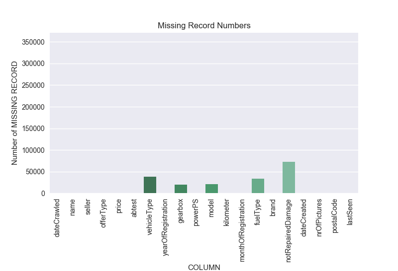  

<i>Figure 1: Missing Value</i> 
<h3>According to Figure 1:</h3>
<ul>
   <li>
   <b>5 columns</b> [<i>vehicleType, gearbox, model, fuelType, notRepairedDamage</i>] have missing values. Depending on the model, these columns can be removed completely. However, these columns could be important for the model. So, the records that have null values can be removed. By removing the null values column can be saved for the model. In the table, notRepairedDamage column has <b>72060 missing value</b> which is the <b>19%</b> of the whole dataset. In this case, removing each record is not the best option. It seems better to drop whole column.
   </li>

   <li>
   In the whole dataset, <b>110572</b> records has at least one missing value. Removing these records are not the best option because it causes  <b>33% data loss</b>. So, data loss can be decreased by dropping some non-important columns or a representing value can be assigned the missing values.
   </li>
</ul>

<h3>According to Table 1 and the Histogram Graph of the columns:</h3>
<ul>
   <li>dateCrawled (280500), name (233531), lastSeen (182806) columns have too many unique values. Depending on the learning model, these columns can be dropped.</li>
</ul>
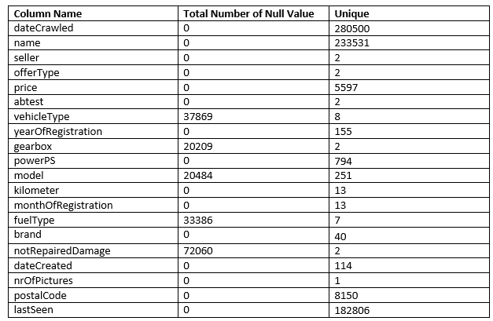

<ul>
   <li>Histogram of <b>nrOfPictures</b> column and Table 1 says that this column has only one values and it has no meaning for model and visualization. This column can be dropped.</li>
</ul>

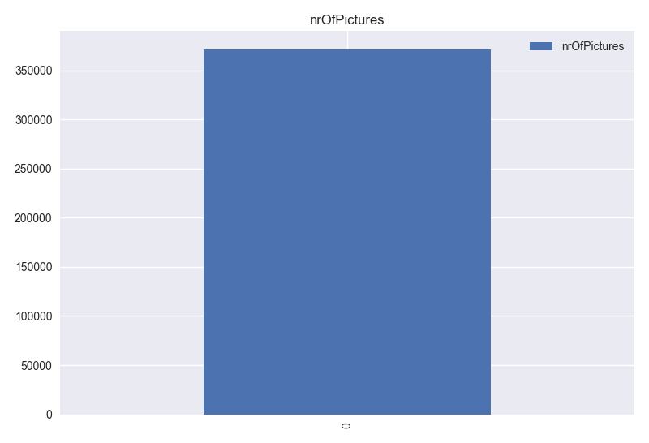 

<ul>
   <li>Histogram graph of <b>seller</b> column and Table 1 says that this column has 2 unique values and “gewerblich” value has only 3 records. So, this column has no distinguishing information for the model. This column can be dropped, but first the records that has “gewerblich” value should be removed.</li>
</ul>

 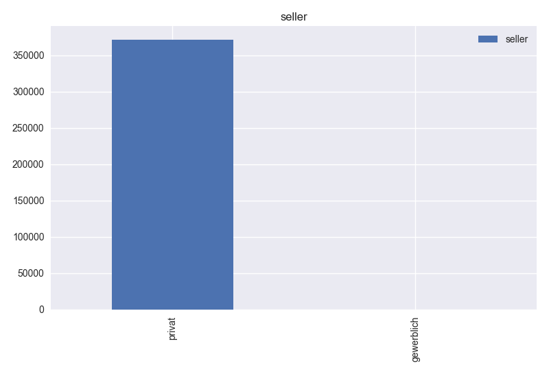 
 
<ul>
   <li>Based on histogram graph of <b>offerType</b>, Table 1 and column description, this column has 2 unique values. “gesuch” value has only 12 records. So, this column has no distinguishing information for the model. This column can be dropped, after removing the records that has “gesuch” value. </li>
</ul>

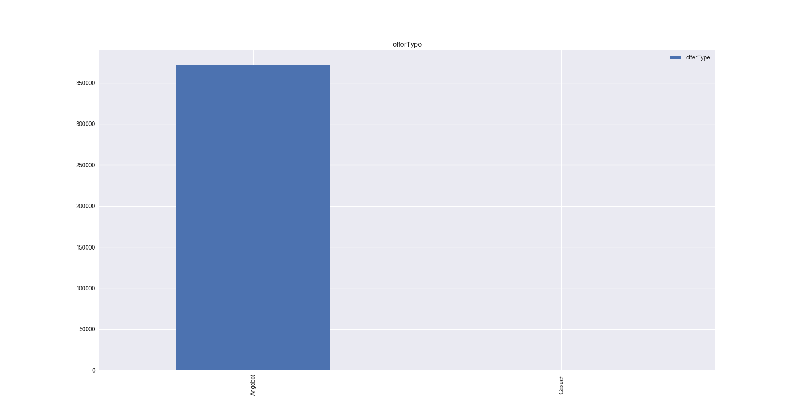 

<ul>
   <li>Based on histogram graph of <b>abtest</b> and Table 1, this column has consistent values for the model. </li>
</ul>

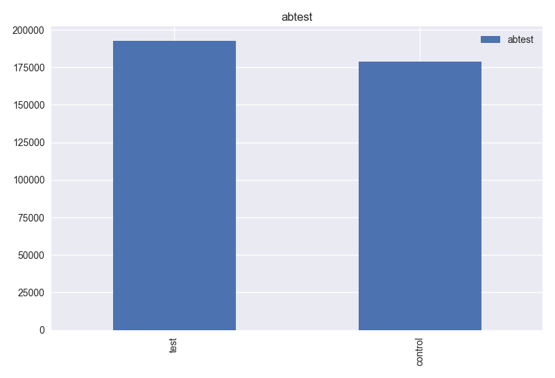 

<ul>
   <li>Based on histogram graph of <b>monthOfRegistration</b> and Table 1, this column should have 12 unique values. However, it has 13 values. Also, dataset has yearOfRegistration column. So, this column can be dropped.</li>
</ul>
 
 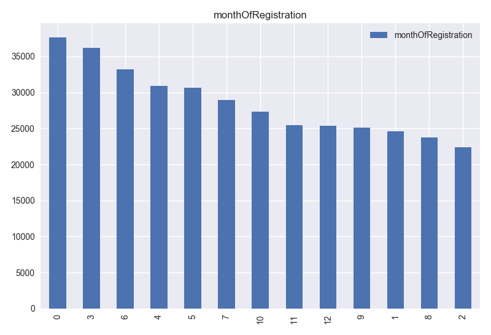 
 
<ul>
   <li><b>postalCode</b> column has <b>8150</b> unique values. This information can be used to determine the location of the car. However, for the model, location is not a distinguishing information because all car has postal code in Germany. Car location does not affect the model. This column can be dropped.</li>
</ul>
 
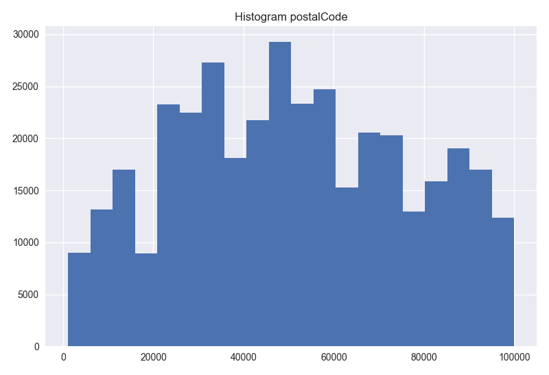 

<ul>
   <li><b>dateCreated</b> column has <b>114</b> unique values. This column has no distinguishing information for the model. So, this column can be dropped</li>
</ul>
 
 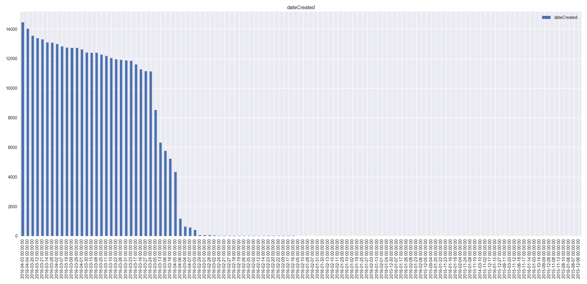 
 
<ul>
   <li>Based on histogram of <b>price</b> column and its description, this column has <b>10772</b> records that has <b>0</b> value which means the car is free. Also, records have some value more than <b>100000 euro</b>. It is not a consistent variable because cars can’t be that much expensive. To make dataset more consistent, prices values which are <b>0</b> and larger than <b>100000</b> can be removed. The histogram graph of price column are below. <b>First</b> graph shows the <b>original distribution</b> of the prices. <b>Second</b> graph shows the prices without <b>free cars</b>. <b>Third</b> graph shows the prices <b>between 0 and 100000 euro</b>. Other records can be removed from the dataset to have consistent values.  </li>
</ul>
 
 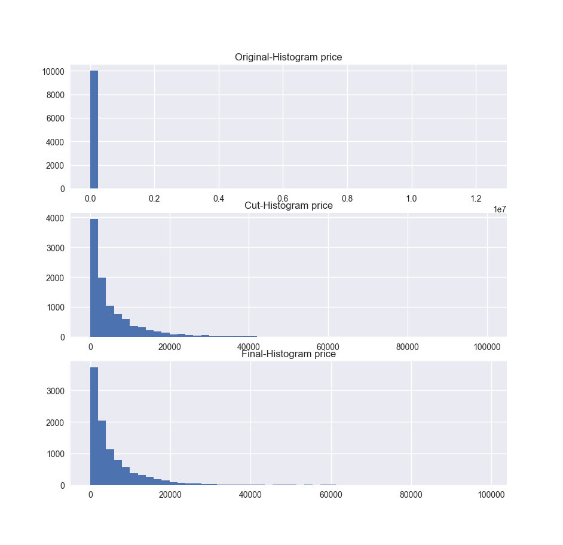 

<ul>
   <li>Based on histogram of <b>yearsOfRegistration</b> column and its description result, this column has inconsistent values. For example, it has year values larger than <b>2017</b>. Also, there are some values smaller than <b>1900</b> which does not make sense because in that time engine did not invented. So, yersOfRegistration records can be limited between <b>1900- yearsOfRegistration-2017</b>.</li>
</ul>
 
 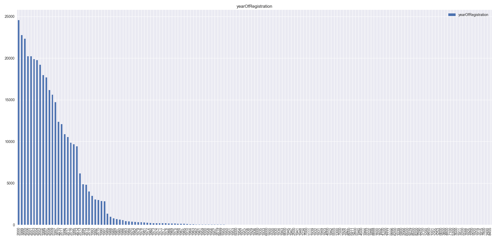 
 
<ul>
   <li>Based on histogram of <b>powerPS</b> and Table 1, this column has some inconsistent values. powerPS can’t be less than <b>0</b>. Also, powerPS can’t be stronger than <b>1000</b>. So, it can be limited between 0-powerPS-1000. Other records can be removed from the dataset to have consistent values.</li>
</ul>

<ul>
   <li>Based on histogram of <b>fuelType</b> and Table 1, this column has 7 different value type. Apart from <b>“benzin”</b> and <b>“diesel”</b>, other values have very low records. So, these values do not mean much for the model. These records can be removed from the dataset.</li>
</ul>
 
 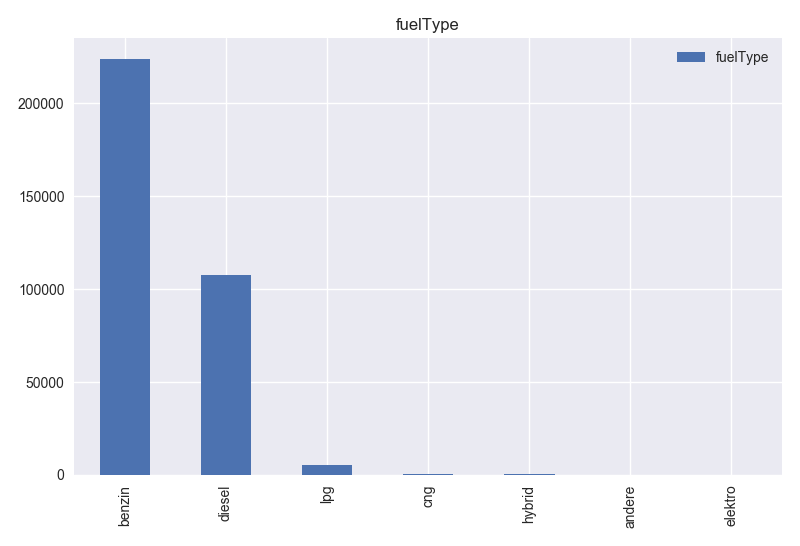 
 
<ul>
   <li>Based on <b>vehicleType</b> histogram and Table 1, it has 8 different values. Values are consistent and can be used for the model.</li>
</ul>
 
 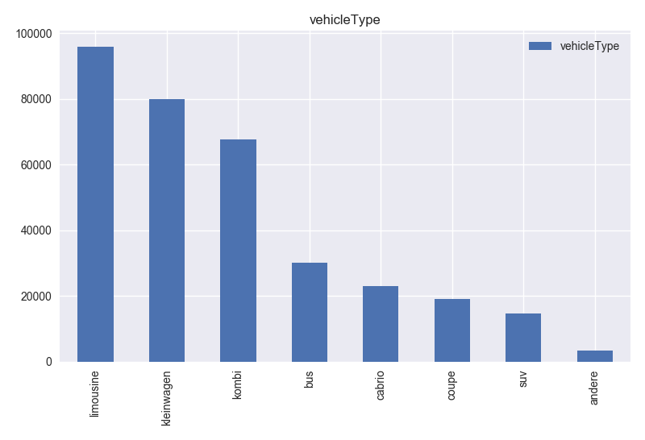 
 
<ul>
   <li>Based on histogram of <b>model</b> and Table 1, this column has many different values. It can be useful for price prediction but to make the model simpler this column can be dropped. </li>
</ul>
 
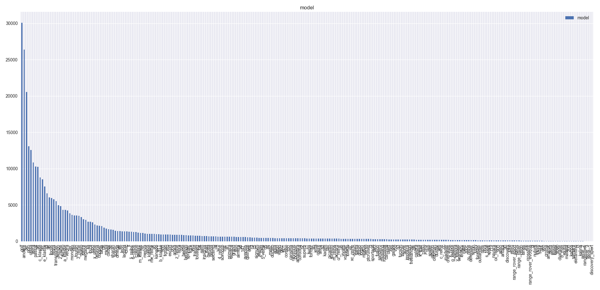 

<ul>
   <li>Based on histogram of <b>kilometer</b> and table 1, this column has consistent values. Also, it can be useful for the model.</li>
</ul>
 
 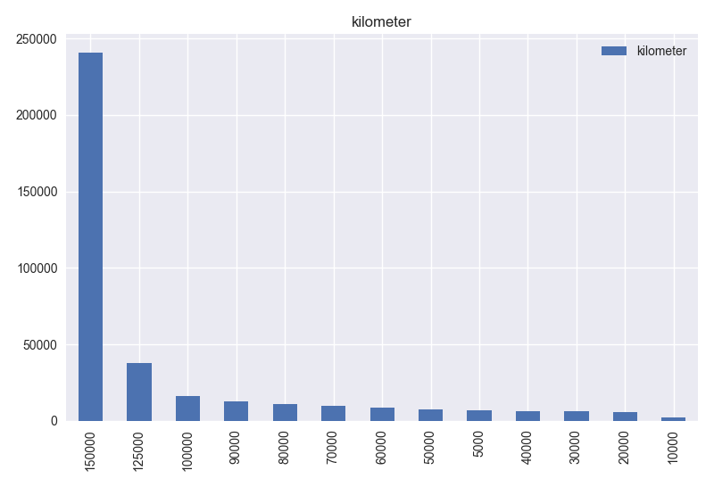 
 
<ul>
   <li>Based on histogram of <b>gearbox</b> and Table 1, this column has 2 different values and values are consistent.</li>
</ul>
               
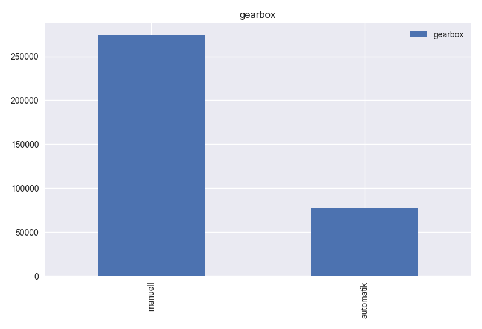 
               
<ul>
   <li>Based on histogram of <b>notRepairedDamage</b>, this column has 2 different values. Values are consistent and can be useful for the model.</li>
</ul>
 
 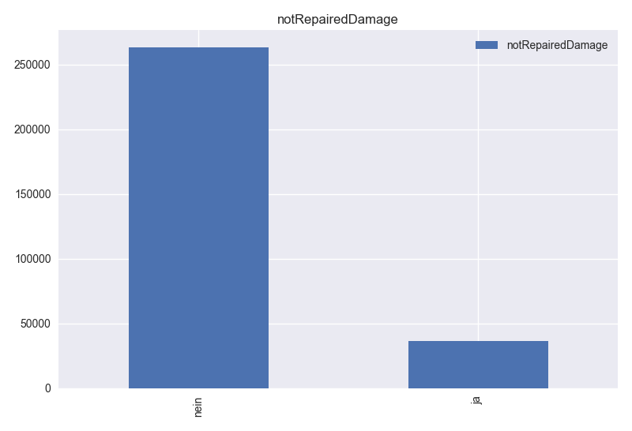 
 
<ul>
   <li>Based on histogram of the <b>brand</b>, this column has 40 different values. It has consistent records and can be useful for the model. Also, it can be said that volkswagen is the most popular car.</li>
</ul>
 
 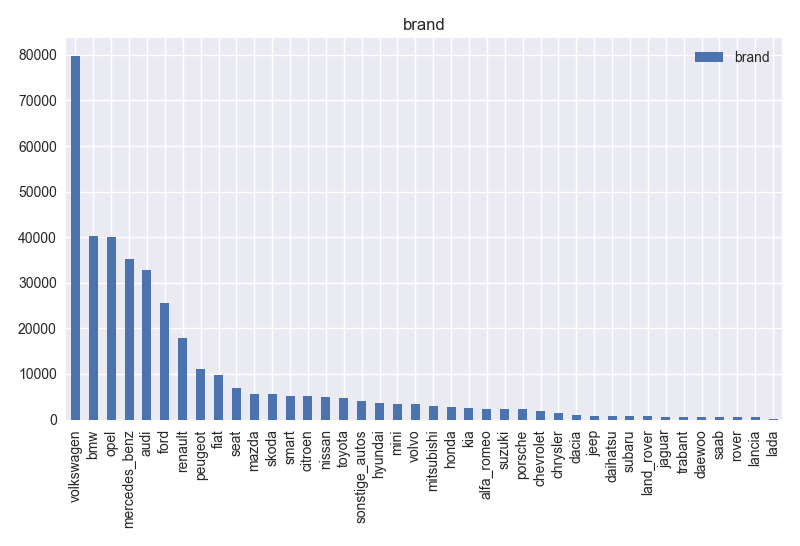 
 
<ul>
   <li>Based on <b>year v.s. price graph</b>, it can be said that new cars are more expensive than old ones. However, there some old cars which are also expensive. </li>
</ul>
 
 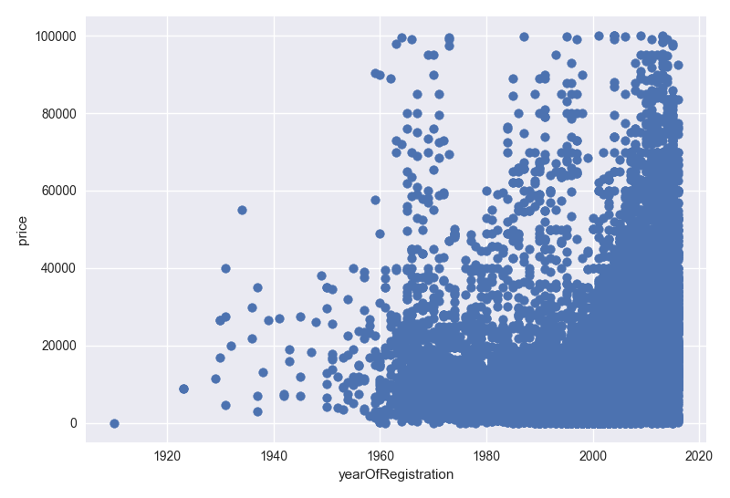 
 
<ul>
   <li>Based on <b>powerPS v.s price graph</b>, low powerPS cars are cheaper than others. </li>
</ul>

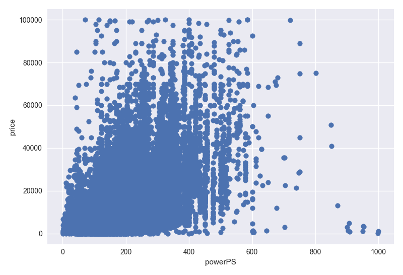 

<h1>3.	PROBLEM SETTING</h1>

The problem is predicting the actual price of the car by looking given parameters. 
There are <b>371528</b> records in dataset. <b>243422</b> of them are remaining after data cleaning process. 
2 models are implemented.  
One of them uses the <b>30%</b> of the dataset as a test set. 
Other one uses <b>33%</b> for testing issue

<h1>4.	MODELLING</h1>

Before the implementation of the model. Dataset is cleaned using python libraries, and total number of column is decreased to 10 [<i>'vehicleType', 'yearOfRegistration', 'gearbox', 'powerPS', 'model','kilometer', 'fuelType', 'brand', 'notRepairedDamage', 'price'</i>]. 

After that, cleaned dataset is preprocessed using WEKA. WEKA attribute evaluator selected some attributes. It suggests the following attributes for the model [<i>'yearOfRegistration', 'gearbox', 'powerPS' ,'kilometer', 'fuelType', 'notRepairedDamage</i>].

<h3>There are 2 different implementation of linear regression model:</h3>
<ul>
   <li>First model is implemented using python sklearn library.</li>
       It has 10 attributes. 
       30 percentage of the dataset is used for testing. 
 
   <li>Second model is implemented using WEKA.</li>
       Attributeselection filter of WEKA applied on the dataset. 
       Filter removed the 3 attributes. Remaining 7 attributes are used for learning. 
       33 percentage of the dataset is used for testing. 
</ul>

<h1>5.	CONCLUSION and IMPROVEMENT POINTS</h1>

First 20 prediction of the both model is on the below table. 
Python Sklearn Regression model has lower error than the WEKA model. 
It gives pretty good result for such a simple model.  
In order to improve the model: 
- dataset cleaning could be more effienct. According to histogram graph of the attributes, they have lots of inconsistent values. 
- age of the car attribute can improve the model. Age attribute could be extracted by using registrationDate and dateCreated attributes. 
- according to attributeselection filter of the WEKA, "kilometer" and "powerPS" attributes are the most important ones. 

<h3>Following results are taken from python sklearn model:</h3>
Root mean squared error: 555.6768635632562 
mean_absulute_error: 397.8973442835626 
mean_squared_error: 308776.7766994987 

<h3>Following results are taken from WEKA model:</h3>
Root mean squared error:4958.1553 
Mean absolute error:                   3103.1781 
Correlation coefficient:                  0.7864 
Relative absolute error:                 56.7852 % 
Root relative squared error:             61.7716 % 
Total Number of Instances:            82763     

<h1>PYTHON SKLEARN LINEAR REGRESSION MODEL RESULT</h1>

Root mean squared error:               555.6768635632562 

<table border="2">
<tr>
<td>inst#</td><td>actual</td><td>predicted</td><td>error</td></tr>

<tr><td>1</td><td align="right">400</td><td align="right">419.435</td><td align="right">19.435</td></tr>
<tr><td>2</td><td align="right">400</td><td align="right">602.408</td><td align="right">202.408</td></tr>
<tr><td>3</td><td align="right">624</td><td align="right">955.720</td><td align="right">331.720</td></tr>
<tr><td>4</td><td align="right">2579</td><td align="right">1690.700</td><td align="right">888.299</td></tr>
<tr><td>5</td><td align="right">2166</td><td align="right">1737.427</td><td align="right">428.572</td></tr>
<tr><td>6</td><td align="right">1697</td><td align="right">2051.277</td><td align="right">354.277</td></tr>
<tr><td>7</td><td align="right">835</td><td align="right">839.545</td><td align="right">4.545</td></tr>
<tr><td>8</td><td align="right">3062</td><td align="right">2340.980</td><td align="right">721.019</td></tr>
<tr><td>9</td><td align="right">2273</td><td align="right">1970.432</td><td align="right">302.567</td></tr>
<tr><td>10</td><td align="right">897</td><td align="right">1485.134</td><td align="right">588.134</td></tr>
<tr><td>11</td><td align="right">2006</td><td align="right">2126.953</td><td align="right">120.953</td></tr>
<tr><td>12</td><td align="right">1225</td><td align="right">1281.999</td><td align="right">56.999</td></tr>
<tr><td>13</td><td align="right">1149</td><td align="right">695.919</td><td align="right">453.080</td></tr>
<tr><td>14</td><td align="right">1863</td><td align="right">1228.076</td><td align="right">634.923</td></tr>
<tr><td>15</td><td align="right">3352</td><td align="right">2866.412</td><td align="right">485.587</td></tr>
<tr><td>16</td><td align="right">2056</td><td align="right">1947.652</td><td align="right">108.347</td></tr>
<tr><td>17</td><td align="right">0</td><td align="right">664.973</td><td align="right">664.973</td></tr>
<tr><td>18</td><td align="right">1975</td><td align="right">1852.990</td><td align="right">122.009</td></tr>
<tr><td>19</td><td align="right">932</td><td align="right">868.003</td><td align="right">63.996</td></tr>
<tr><td>20</td><td align="right">3435</td><td align="right">2710.145</td><td align="right">724.854</td></tr>
</table>
<h1>WEKA MODEL RESULT</h1>

Root mean squared error:               4958.1553 

<table border="2">
<tr>
<td>inst#</td><td>actual</td><td>predicted</td><td>error</td></tr>
<tr><td>1</td><td align="right">9499</td><td align="right">5840.168</td><td align="right">-3658.832</td></tr>
<tr><td>2</td><td align="right">7990</td><td align="right">12515.27</td><td align="right">4525.27</td></tr>
<tr><td>3</td><td align="right">4000</td><td align="right">5139.611</td><td align="right">1139.611</td></tr>
<tr><td>4</td><td align="right">10700</td><td align="right">14125.198</td><td align="right">3425.198</td></tr>
<tr><td>5</td><td align="right">690</td><td align="right">-3346.537</td><td align="right">-4036.537</td></tr>
<tr><td>6</td><td align="right">1450</td><td align="right">3834.998</td><td align="right">2384.998</td></tr>
<tr><td>7</td><td align="right">1000</td><td align="right">720.987</td><td align="right">-279.013</td></tr>
<tr><td>8</td><td align="right">7800</td><td align="right">5329.186</td><td align="right">-2470.814</td></tr>
<tr><td>9</td><td align="right">8150</td><td align="right">8553.781</td><td align="right">403.781</td></tr>
<tr><td>10</td><td align="right">1111</td><td align="right">720.987</td><td align="right">-390.013</td></tr>
<tr><td>11</td><td align="right">9899</td><td align="right">16116.077</td><td align="right">6217.077</td></tr>
<tr><td>12</td><td align="right">150</td><td align="right">-4427.849</td><td align="right">-4577.849</td></tr>
<tr><td>13</td><td align="right">2000</td><td align="right">5802.808</td><td align="right">3802.808</td></tr>
<tr><td>14</td><td align="right">15000</td><td align="right">11530.067</td><td align="right">-3469.933</td></tr>
<tr><td>15</td><td align="right">8000</td><td align="right">10208.546</td><td align="right">2208.546</td></tr>
<tr><td>16</td><td align="right">4190</td><td align="right">4656.816</td><td align="right">466.816</td></tr>
<tr><td>17</td><td align="right">16000</td><td align="right">20750.782</td><td align="right">4750.782</td></tr>
<tr><td>18</td><td align="right">6000</td><td align="right">7567.218</td><td align="right">1567.218</td></tr>
<tr><td>19</td><td align="right">2800</td><td align="right">4278.547</td><td align="right">1478.547</td></tr>
<tr><td>20</td><td align="right">399</td><td align="right">1198.466</td><td align="right">799.466</td></tr>
</table>

</body>
